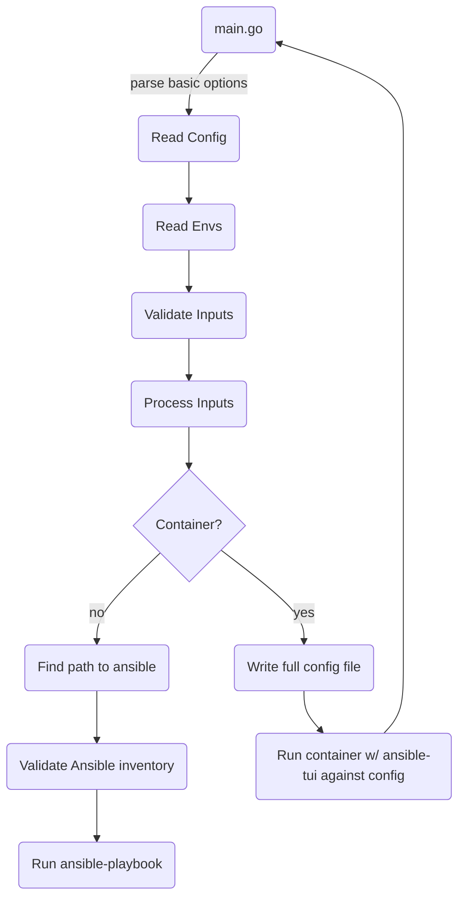

# ansible-tui

## Description

ansible-tui is a lightweight CLI wrapper written in Go for running ansible-playbook.  ansible-tui provides both an environment-variable and YAML based API to enable ansible-playbook to be run by other tools and services.

## How it works



## Usage

See [setup](#setup) instructions below for dependencies and first-time setup.

ansible-tui first looks for a YAML configuration file with the playbook execution parameters.  The path to the YAML configuration file can be specified with either PB_CONFIG_FILE environment variable or with the -c command line option.

### CLI

```bash
$ ansible-tui -h
Usage of ansible-tui:
  -c string
    	Playbook config file (PB_CONFIG_FILE)
  -g	Generate ansible-tui.yml template and exit
  -nt
    	No TUI.  Runs playbook from configuration file without TUI
  -v	Sets log level for ansible-tui to INFO (default WARN)
  -version
    	Display version and exit
  -vv
    	Sets log level for ansible-tui to DEBUG (default WARN)


$ ansible-tui --version
Version:	v0.1.1
Build date:	20240214
```

See [example output](#example-output) below.

### Parameters

- The final configuration must minimally include the playbook and inventory file.
- Environment variables have higher precedence and can override parameters in the YAML configuration file.
- ENV Parameters are all environment variables and therefore strings.
- YAML parameters are all strings unless otherwise noted (verbose-level).

| ENV Parameter | YAML Parameter | Purpose | ansible-playbook CLI option |
| ------------- | -------------- | ------- | --------------------------- |
| TMP_DIR_PATH   | temp-dir-path | Relative or absolute path to temporary location to write files (default ./.ansible) | NA |
| PB_CONFIG_FILE | NA | Relative path to YAML configuration which is read before environment variables are processed.  Can also be passed to ansible-tui with -c.  Default is TMP_DIR_PATH/ansible-tui.yml. | NA |
| PLAYBOOK | playbook | Relative path to the playbook to execute | NA |
| VERBOSE_LEVEL | verbose-level (int) | String containing 0-4, corresponding the number of v's controlling the level of verbosity | -v, -vv, -vvv, -vvvv |
| SSH_PRIVATE_KEY_FILE | ssh-private-key-file | Path to SSH private key (for SSH connections only) | NA |
| ANSIBLE_REMOTE_USER | remote-user | Remote user for target machine | NA |
| INVENTORY_FILE | inventory | Absolute or relative path to inventory file (no backward traversal w/ "..") | -i |
| INVENTORY_CONTENTS | NA | Multi-line string containing inventory contents.  Contents are written to a file and passed via -i ./hosts-INVENTORY | NA |
| INVENTORY_URL | NA | Retrieves a single Ansible inventory file from a URL to be used as INVENTORY_FILE | NA |
| LIMIT_HOST | limit | Limit targets hosts to a host or group name or pattern resolved in Ansible inventory | --limit |
| EXTRA_VARS_FILE | extra-vars-file | Absolute or relative path to extra-vars file (no backward traversal w/ "..") | -e --extra-vars |
| EXTRA_VARS_CONTENTS | NA | Multi-line string containing extra-vars contents.  Contents are written to a file and passed via -e ./PLAYBOOK-extravars | NA |
| ANSIBLE_TAGS | tags | Run Ansible tasks with specific tag values (TBD) | --tags |
| ANSIBLE_SKIP_TAGS | skip-tags | Skip Ansible tasks with specific tag values (TBD) | --skip-tags |
| EXTRA_ARGS | extra-args | Additional options appended to ansible-playbook command | NA |
| WINDOWS_GROUP | windows-group | Group name in Ansible inventory where WinRM should be used with WinRM parameters (TBD) | NA |
| VIRTUAL_ENV | virtual-env-path | Path to Python virtual environment directory (must contain ./bin/ansible-playbook) | NA |
| CONTAINER_IMAGE | image | Container image URI with ansible-tui, ansible-playbook, and any other playbook runtime dependencies (see [Dockerfile](./Dockerfile))| NA |
| ANSIBLE_PLAYBOOK_TIMEOUT | playbook-timeout | Number of seconds to timeout playbook execution | NA |
|               | execution-type | optional to specify "container" or "venv" in case both image and virtual-env-path are defined | NA |

- Only one INVENTORY_ parameter is required
- Only one EXTA_VARS_ parameter can be specified
- Either VIRTUAL_ENV or CONTAINER_IMAGE can be specified.  In a container image, ansible-playbook must be in the environment's PATH.

### TUI-specific Parameters

These parameters are nested under the "tui" key in the YAML file to assist populating the TUI with relevant files to set playbook parameters.

| ENV Parameter        | YAML Parameter | Purpose | ansible-playbook CLI option |
| -------------------- | -------------- | ------- | --------------------------- |
| NO_TUI               | NA             | Do not use TUI, just run supplied configuration file |
| TUI_PLAYBOOK_DIR     | playbook-dir   | Relative path to directory with playbook files.  Will NOT recurse UNLESS value is ".".  The default is "./playbooks" if it exists, otherwise ".". | NA |
| TUI_INVENTORY_DIR    | inventory-dir  | Relative path to directory with inventory files.  Will recurse UNLESS value is ".".  The default is "./inventory" if it exists, otherwise "." | NA |
| TUI_VIRTUAL_ENVS_DIR | virtual-envs-dir  | Absolute path to directory containing one or more directories with Python virtual environments.  The ~ character is allowed as a shortcut to the HOME directory.  The default is "", indicating no virtual environments will be used. | NA |
| TUI_IMAGE_FILTER     |  image-filter  | Simple string to filter list of images to display.  Default "ansible".  Unset or use "" will display all images. | NA |


### YAML Configuration file

All configuration file arguments are initialized to empty-string or 0 based on the variable type.  Only non-empty configurations need to be specified in the configuration file.

```yaml
---
virtual-env-path: "~/Documents/venv/ansible-latest"
# image: ansible-tui:latest
ssh-private-key-file: "~/.ssh/id_rsa"
remote-user: root
inventory: "./examples/hosts.yml"
playbook: "./examples/site.yml"
verbose-level: 1
environment-variables:
  pass:
    - ONE
    - TWO
    - THREE
  set:
    KEY1: VALUE1
    KEY2: VALUE2
    KEY3: VALUE3
tui:
  playbook-dir: ./playbooks
  inventory-dir: ./inventory
  image-filter: ansible
  virtual-envs-dir: ~/venvs

```

## Setup

### Dependencies

To build project:
- [Taskfile](#taskfile-setup)
- [go](#go-setup) >= 1.22.0

The runtime for ansible can use a globally installed ansible, a virtual environment, or a container.

For playbook execution (local):
- ansible-playbook (prefer Python virtual environment instead of global, see [python setup](#python-virtual-environment-setup) below)

For playbook execution (container):
- Docker or Podman (podman will be used if both are found, see [container setup](#container-runtime) below)


### Taskfile setup

https://taskfile.dev/installation/

- Download and put the file in the PATH (ex. /usr/local/bin/task).
- Ensure it is executable (chmod +x /usr/local/bin/task).
- Tasks are defined in Taskfile.yml and can be listed with `task --list`.

```bash
$ task --list
task: Available tasks for this project:
* clean:                Cleanup build and test directories
* coverage:             Run code coverage test
* dep:                  Update dependencies
* docker_build:         Build the container image and cleanup dangling images (docker)
* fmt:                  Auto-correct lint issues
* go_build_linux:       Build the go binary for Linux
* go_sec:               Security scanning of code using Salus, which runs Gosec, GoOSV, and other tools
* podman_build:         Build the container image and cleanup dangling images (podman)
* test:                 Run go test
* vendor:               Vendor go modules in ./vendor directory
```

### Go setup

https://go.dev/doc/install

- Go 1.22.0 or higher is required due to the use of logging features (slog) introduced in 1.22.0.
- The basic setup for go is to download the tar file to /usr/local and unpack to /usr/local/go.
- Then setup your profile (~/.profile, ~/.bash_profile, ~/.bashrc) to include the following:

```bash
# set variables for go if it exists
if [ -d "/usr/local/go/bin" ] ; then
    PATH="$PATH:/usr/local/go/bin:$HOME/go/bin"
    export GOPATH=~/go
    export GOROOT=/usr/local/go
fi
```

After sourcing the updated profile, verify version of go.

```bash
$ go version
go version go1.22.0 linux/amd64
```

### Build and install binary

```bash
$ task go_build_linux
$ sudo cp ./out/ansible-tui-*-linux-amd64 /usr/local/bin/ansible-tui
$ sudo chmod 755 /usr/local/bin/ansible-tui
```

### Python virtual environment setup

To create a virtual environment with python modules for Ansible (Debian/Ubuntu):

```bash
apt-get install -y python3-virtualenv
mkdir ~/Documents/venv
virtualenv -p python3 ~/Documents/venv/ansible-latest
source ~/Documents/venv/ansible-latest/bin/activate
pip3 install -r ./test/requirements.txt
```

### Container runtime

- The included Dockerfile builds a basic Ansible runtime environment and includes ansible-tui.
- Docker or Podman can be used to execute ansible inside a container.  If both Docker and Podman are installed, Podman is used.
- Docker and Podman use separate image caches.  Docker will not find a local container in the Podman registry and vice-versa.  The image should be pushed to an external registry.
- When building the image, the default container name and tag are specified in the `vars` section at the top of Taskfile.yml.

#### Docker

```bash
$ task docker_build
```

#### Podman


```bash
$ task podman_build
```

## Example output

The following output is from a container execution using podman.  The final return code is determined by the return code from ansible-playbook.

```bash
$ ansible-tui -c examples/ansible-tui.yml 
Using /etc/ansible/ansible.cfg as config file

PLAY [Playbook for testing simple Ansible modules] *****************************

TASK [ping ssh target] *********************************************************
ok: [testhost] => {"ansible_facts": {"discovered_interpreter_python": "/usr/bin/python3"}, "changed": false, "ping": "pong"}

PLAY RECAP *********************************************************************
testhost                   : ok=1    changed=0    unreachable=0    failed=0    skipped=0    rescued=0    ignored=0   

$ echo $?
0
```


## Testing

The tests defined in main_test.go pass input parameters via environment variables to run a test/playbook-simple.yml against localhost (test/inventory-localhost.ini).

```bash
$ task test
```

## License

MIT
